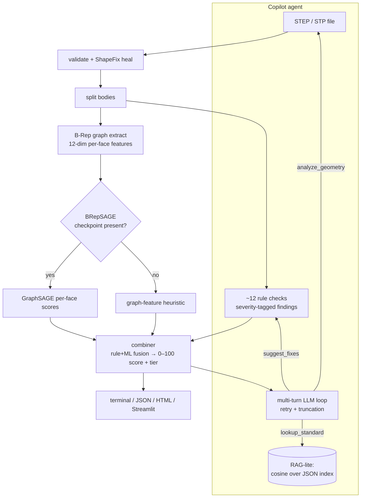
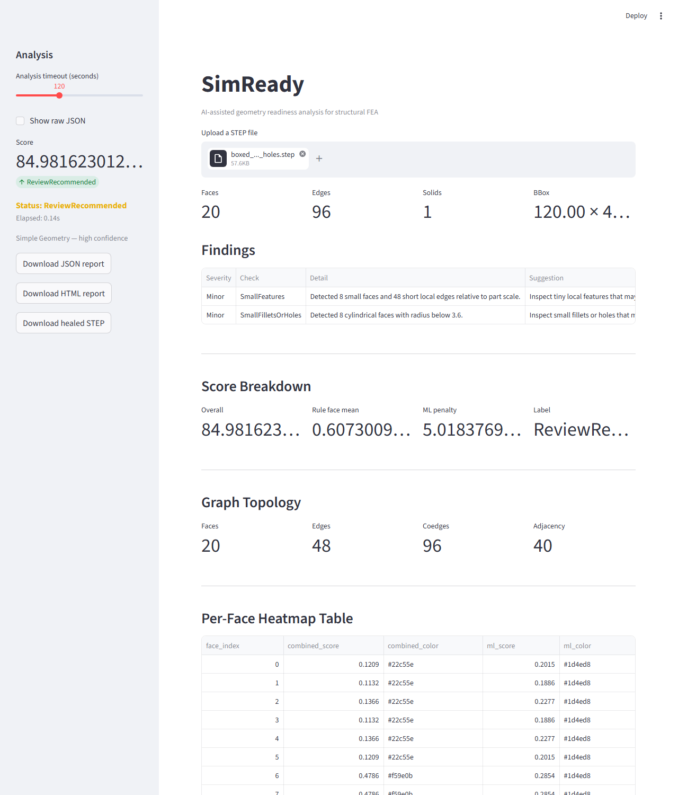

# SimReady

An AI copilot for FEA pre-processing. Point it at a STEP file; it analyzes B-Rep
geometry for meshing/manufacturability problems, scores simulation-readiness 0–100,
and explains the findings through a multi-turn LLM agent.

**Scope: analysis and validation only.** SimReady reads geometry and reports on it —
it does *not* generate or modify CAD (healing is a best-effort OCC ShapeFix pass, not a
design edit). Geometry generation is on the roadmap, not built.

## Capabilities

- **Multi-turn LLM tool-use agent** over the pythonOCC pipeline. Provider-swappable via
  one `OPENAI_BASE_URL` env var (OpenAI / NVIDIA NIM / OpenRouter / local Ollama+shim).
  Exponential-backoff retry on rate-limit/transient errors; token-budgeted tool-result
  truncation (drops per-face score blobs → ML internals → caps findings, in that order)
  so large CAD reports don't blow the context window. Three tools: `analyze_geometry`,
  `suggest_fixes`, `lookup_standard` (RAG). — `simready/copilot/agent.py`, `tools.py`
- **B-Rep → graph encoder feeding a GNN.** OCC topology is walked into a face-adjacency
  graph with **12-dim per-face features** (surface-type one-hot ×7, log-area, normal
  magnitude, mean curvature, UV-u extent, UV-v extent). A **2-layer GraphSAGE** ("BRepSAGE")
  with three heads: per-face refinement (binary), per-face complexity (regression), and a
  graph-level 4-class defect classifier. The refinement label is rule-derived
  (`rule_per_face > 0.5`) and therefore circular; the defect head trains on **injected
  ground-truth defect tags** — a genuinely non-circular signal. **Dual backend with honest
  provenance** — trained checkpoint when present, graph-feature heuristic when not; every
  report states `weights_loaded` / `score_source` / `model_name`.
  — `simready/ml/model.py`, `brepnet.py`, `graph_extractor.py`
- **Eval discipline.** A 6-metric copilot harness (tool-call exact/partial/order, format,
  sections, theme hit-rate) scored against a **50-example hand-written gold set** held out
  of all training data. The GNN ships with a real-CAD validation gate that *documents where
  it fails* instead of hiding it (see Results). — `scripts/eval_finetune.py`,
  `tests/data/gold_traces.jsonl`, `docs/validation/`
- Rule layer: ~12 OCC geometry checks (manifoldness, zero-length/short edges, sliver faces,
  thin solids, self-intersection, small features/fillets) fused with the GNN into one 0–100
  score + complexity tier. Self-intersection check hardened against OCC pathologies
  (face-count guard + 30 s watchdog: a part that hung >10 min now finishes in 6.3 s).
- Reports in four forms: terminal, JSON, single-file HTML, and two Streamlit UIs
  (analysis dashboard + agent chat).

## Architecture



## Quickstart

pythonOCC needs conda:

```bash
micromamba create -f environment.yml      # or: conda env create -f environment.yml
micromamba activate simready
pip install -r requirements.txt           # copilot/UI deps: openai, sentence-transformers, pypdf, streamlit
```

Analyze a part — no LLM, no API key:

```bash
python -m simready.cli analyze tests/data/smoke_box.step           # pretty terminal report
python -m simready.cli analyze part.step --json                    # machine-readable
python -m simready.cli analyze part.step --html report.html        # shareable single file
python -m simready.cli analyze part.step --export-healed out.step  # ShapeFix-healed STEP
```

Run the copilot — needs an OpenAI-compatible endpoint:

```bash
cp .env.example .env       # set OPENAI_API_KEY; OPENAI_BASE_URL for non-OpenAI providers
python -m simready.copilot.cli tests/data/smoke_box.step "What's wrong with this part and how do I fix it?"
```

Streamlit UIs:

```bash
streamlit run ui/copilot_app.py   # agent chat + per-face score render + runtime backend selector
streamlit run ui/app.py           # analysis-only dashboard (findings, score breakdown, downloads)
```

Analysis dashboard (`ui/app.py`) on a ribbed-bracket fixture — findings, fused score
breakdown, graph topology, and the per-face heatmap table (combined + ML scores). Regenerate
with `python scripts/ui_screenshots.py` against a running UI.



Provider config (`.env`): `OPENAI_API_KEY` (required), `OPENAI_BASE_URL`
(blank = OpenAI · NIM `https://integrate.api.nvidia.com/v1` · OpenRouter
`https://openrouter.ai/api/v1` · Ollama `http://localhost:11434/v1`), `OPENAI_MODEL`.

Optional FEA-standards index for `lookup_standard` (the tool returns `no_index` until built):

```bash
# add public PDF URLs to data/fea_docs/sources.txt, then:
python scripts/scrape_fea_docs.py
python scripts/index_fea_docs.py   # → data/fea_docs_index.json
```

## Results & Limitations

**Read the label-source column before the accuracy column.** The model's *refinement* head
trains on `rule_per_face > 0.5` — a deterministic threshold on the *same* OCC features the GNN
ingests (`scripts/auto_label.py`), so its accuracy measures "can a GraphSAGE re-learn my rule,"
not agreement with external ground truth. The *defect* head is different: it trains on
ground-truth defect tags injected by `scripts/generate_degraded_steps.py`, independent of the
rule layer — a **non-circular** signal. All numbers below are committed and reproducible
(`weights/brepnet.pt` 16 KB · `weights/metrics.json` · `weights/brepnet_meta.json` full
per-epoch history · `weights/eval_fixtures.json`). Trained CPU-only (15 epochs / 25 s) on
**1100 graphs** — 500 synthetic parametric + 600 degraded (200 bases × open-shell /
sliver-face / self-intersection).

### Held-out validation (n=205 val graphs · source-grouped 80/20, leakage-free)

The 80/20 split is grouped by source part (`split_train_val_by_source`): every degraded
variant of a base part stays on one side, so no part the model trained on reappears (degraded)
in validation. That's why the split is 895/205 rather than the 880/220 a random split would
give — a deliberate, leakage-free held-out set.

| Head | Label | Metric | Value |
|---|---|---|--:|
| Refinement (per-face) | `rule_per_face>0.5` — **circular** | accuracy / precision / recall | 0.848 / 0.944 / 0.487 |
| Defect (graph-level, 4-class) | injected tags — **non-circular** | accuracy | 0.756 |

Defect per-class accuracy: clean 0.87 · open_shell 0.57 · sliver_face 1.00 ·
**self_intersection 0.37** — the hardest defect to read from topology features alone, and an
honest weak spot rather than a hidden one.

### Held-out generalization (refinement head)

| Eval set | n | Distribution | Acc | Prec | Recall |
|---|---|---|--:|--:|--:|
| Hand-built fixtures | 7 graphs / 51 faces | harder, hand-made (out-of-train) | 0.725 | 0.750 | 0.692 |
| Real GrabCAD (unlabeled) | 3 parts, 87 / 107 / 161 faces | real CAD imports | ML aggregate **0.37–0.45** vs rule mean 0.67–0.88 |||

Adding the 600 degraded variants to training lifted held-out-fixtures recall from **0.23 → 0.69**
over the earlier parametric-only checkpoint. On real GrabCAD the model still scores well below
the rule layer (overall 37.5 / 36.6 / 61.0; latency 7.45 / 2.22 / 2.87 s wall-clock for the full
pipeline — OCC parse + heal + ~12 checks + GNN). That gap is the point of the gate: it's
documented, not hidden.

### Copilot eval — gold set (n=50)

Reference run only: `meta/llama-3.3-70b-instruct` as teacher/ceiling. **No fine-tuned model
has been trained** (see Roadmap), so the base and LoRA columns are empty by design.

| tool_call_exact | partial | order_ok | format_ok | sections_ok | theme_hit |
|--:|--:|--:|--:|--:|--:|
| 0.76 | 0.92 | 0.78 | 0.78 | 0.78 | 0.68 |

### Known limits

- The **refinement head label is still circular** (`rule_per_face>0.5`); only the defect head
  has a non-circular label. No external/non-circular *refinement* target yet; no labeled
  real-CAD test set.
- Fine-tuning is a **pipeline + eval harness**, not a trained model — no Base-vs-LoRA result.
- 167 tests pass, but the LLM-facing tests mock the client — test count is not an ML-quality
  signal.
- Self-intersection check skipped above 150 faces (OCC `BOPAlgo` scaling). Validated only on
  single-body parts <200 faces; assemblies untested.
- No geometry generation, no mesher hook, no CI.

## Roadmap

1. **A non-circular refinement target.** Done so far: a graph-level defect head trained on
   injected ground-truth tags (non-circular), and a retrain on parametric+degraded that lifted
   held-out-fixtures recall 0.23 → 0.69. Still open: the per-face *refinement* head learns
   `rule_per_face>0.5`. Replace that with a label the rule layer doesn't already produce
   (downstream meshing-failure outcomes, or hand-labeled faces) so the per-face score adds
   information.
2. **Labeled real-CAD test set** (SimJEB / GrabCAD) as a true generalization probe against the
   >0.50 recall exit criterion — currently only an unlabeled gate exists.
3. **Finish one QLoRA run** to fill the Base-vs-LoRA comparison, then stop — keep the harness.
4. **Geometry-generation MVP** — constrained LLM → pythonOCC param code → execute → SimReady
   pipeline → BRepSAGE validates → refine loop. Deliberately planned, not impulse-built.
5. CI; mesher (Gmsh) hook.

## Project layout

```
simready/        cli · pipeline · validator · healer · checks · occ_utils · report · html_report
  ml/            graph_extractor · model (BRepSAGE) · brepnet (dual-backend) · combiner · dataset
  copilot/       agent (tool-use loop) · tools · rag · cli · render
ui/              app.py (analysis) · copilot_app.py (agent chat)
scripts/         train · evaluate · auto_label · generate_parametric_steps · generate_degraded_steps
                 · prep_finetune_dataset · eval_finetune · scrape_fea_docs · index_fea_docs · …
tests/           167 tests
weights/         brepnet.pt (16 KB) · metrics.json · brepnet_meta.json · eval_fixtures.json  (tracked)
docs/            validation/ · impl/ · exec-plans/ · sample_output/ (committed CLI output) · img/
                 CONTEXT.md = domain glossary
```

## License

[MIT](LICENSE)
